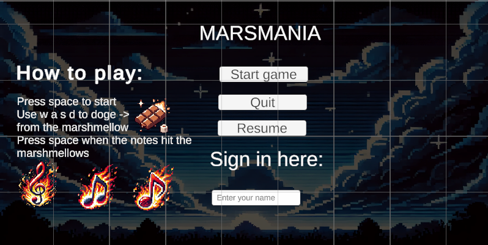
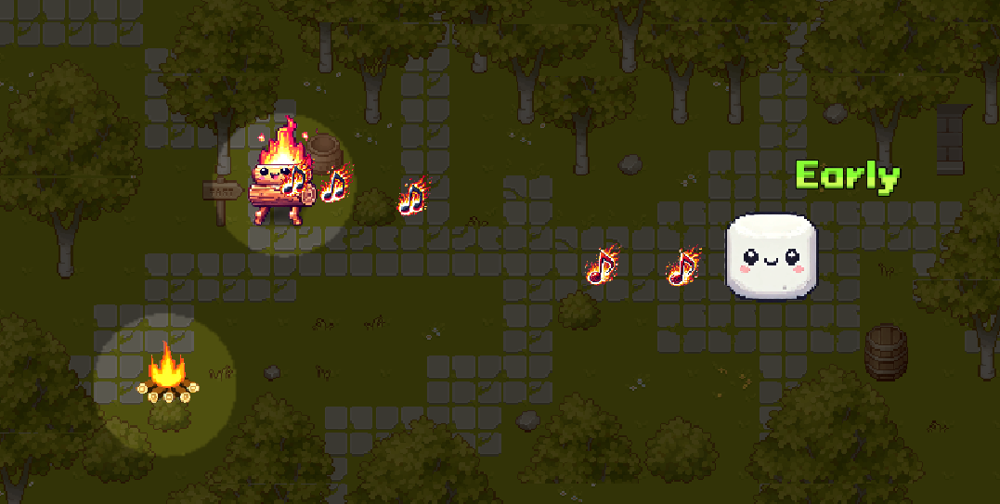

# 🎮 Marsmania - Beta Game Jam 2024 🎮

**Marsmania** is a fun and engaging rhythm game created for the **Beta Game Jam 2024**, themed **"How to roast a marshmallow"**.

---

## 📜 **About the Game**
In Marsmania, you play as a campfire 🔥 trying to "roast" a marshmallow 🧁 by hitting the rhythm perfectly! Use your reflexes and timing skills to press **space** as notes (flames) hit the marshmallow.

---

## 🎮 **How to Play**
1. **Press space** to start the game.
2. Use **W A S D** to dodge projectiles from the marshmallow.
3. Press **space** when the notes (flames) hit the marshmallow to score points.
4. Timing is everything! Hit the notes **perfectly** for the best score.  
   
---

## 🖼️ **Screenshots**

### **Main Menu**


### **Gameplay**


---

## 🚀 **Controls**
- **W / A / S / D** - Move to dodge projectiles.
- **Spacebar** - Hit the notes in rhythm.

---

## ⚙️ **Features**
- Addictive rhythm-based gameplay 🎵  
- Fun pixel art graphics 🎨  
- Real-time scoring based on timing accuracy 🕒  
- Dynamic notes synchronized to gameplay 🎶  

---

## 🔧 **Tech Stack**
- **Engine**: Unity
- **Language**: C#
- **Art**: Custom Pixel Art

---

## 📥 **Installation**
1. Clone the repository:
   ```bash
   git clone git@github.com:ErlendTregde/GameJamBeta2024.git
   cd GameJamBeta2024

## 👨‍💻 Developer  
**Erlend Tregde**  

This project was made for the **Beta Game Jam 2024**.

---

## 📜 License  
This project is open source. Feel free to use it, but give credit to the original author!

   
